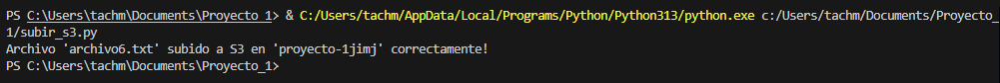
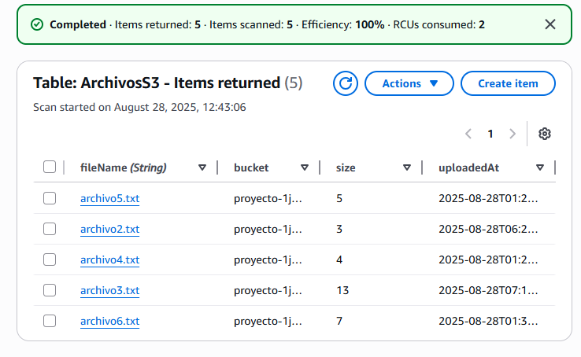
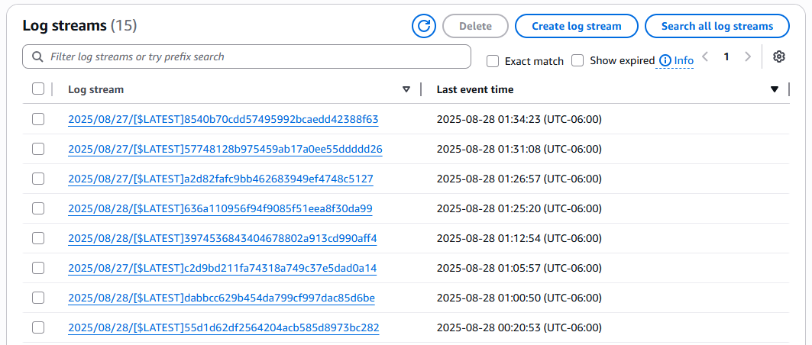
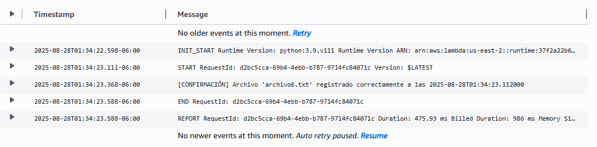
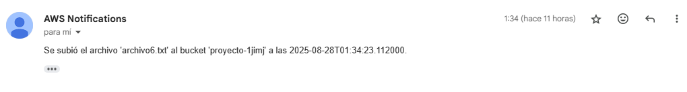
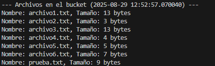

# CloudEventProcessor
Python VS Code system that processes files in S3, logs events in DynamoDB, and sends notifications via SNS. Integrates AWS Lambda, CloudWatch, and EC2.

Files are uploaded to S3 from Python with VS Code. [S3 Script](subir_s3.py) 

The lambda is coded so that every time a file is uploaded, it enters the DynamoDB database and creates an alert: [Lambda Script](lambda_function.py) 

That can be seen in CloudWatch: 

Or in the email via SNS: 

An EC2 was configured to independently run the Python scripts that interact with S3 and view the files it contains: [EC2 Script](EC2.py) 
-

